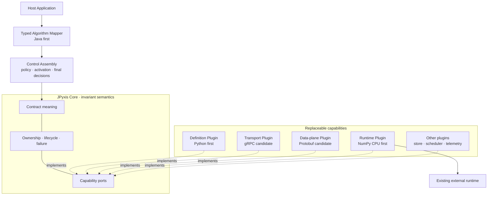
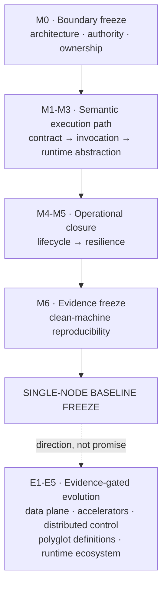
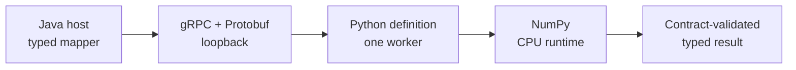

# JPyxis

> **Contract-Driven Heterogeneous Compute**
>
> Control governs. Definitions describe. Runtimes execute. Contracts bind.

JPyxis is a planned framework for governing heterogeneous compute workloads through explicit, versioned contracts. Its first reference profile will study a Java control plane, a Python definition frontend, and an existing CPU runtime. Those languages and runtimes are reference adapters, not the identity of the architecture.

## Status

**`M0 FROZEN · M1 CONTRACT NEXT · BLUEPRINT ONLY`**

No framework implementation exists in this repository. The documents describe hypotheses, boundaries, frozen M0 state models, and future experiments. They must not be cited as evidence that JPyxis is implemented, performant, production-ready, distributed, GPU-capable, or reproducible.

The M0 blueprint is frozen at `m0-blueprint-v1`. The next accepted work is the bounded M1 contract design; no framework production code exists yet.

## Problem statement

Java-centric systems can already call Python, load portable models, or invoke external inference servers. The unresolved design question studied here is narrower:

> Can a host application retain authority over policy, lifecycle, version activation, failure interpretation, and business truth while definition frontends remain expressive and existing runtimes retain responsibility for execution?

JPyxis does not treat cross-language calling itself as novel. Its candidate contribution is a coherent contract and ownership model spanning:

- host-facing mapper ergonomics;
- scalar, record, and tensor meaning;
- immutable artifact identity and compatibility;
- deployment and invocation lifecycle;
- fault ownership and recovery evidence;
- replaceable definition, transport, and runtime adapters.

These are research hypotheses until experiments validate them.

## Architecture at a glance

JPyxis keeps invariant semantics at the centre and places replaceable mechanisms behind declared
capability ports. The diagram is a responsibility and dependency view, not an implemented component
inventory.



High cohesion is permitted inside a responsibility group. Between groups, only versioned contracts
and declared capabilities may cross the boundary. Runtime request flow never reverses compile-time
dependency or grants a plugin control-plane authority.

## First-stage proof boundary

Single-node execution is not a reduced substitute for the first stage. It is the declared proof boundary.

Within that boundary, M0-M6 must eventually provide real implementation, automated tests, fault injection, observable evidence, and clean-machine reproduction. Outside that boundary, this repository records only attachment points, entry conditions, and non-binding evolution directions.

The candidate reference environment is:

```text
RAM:      16 GB target, currently INFERRED rather than observed
CPU:      commodity x86-64
GPU:      not required
Topology: bounded single-node workers
Runtime:  CPU baseline
```

The `16 GB single-machine capable` claim becomes a project fact only after M6 records actual measurements.

## Architecture constitution

The M0 constitution is intentionally about invariants, not concrete API fields:

1. The contract is the only cross-boundary source of meaning.
2. The control plane owns decisions; a Java implementation is the first profile.
3. Definition frontends own declarative algorithm meaning; Python is the first profile.
4. Runtime adapters execute through existing runtimes; JPyxis does not rebuild kernels or tensor engines.
5. Events may cross a boundary; state ownership may not.
6. Every persisted fact has exactly one final authority.
7. Artifacts are immutable and content-addressed; activation is a separate control-plane fact.
8. Control and data planes remain separable.
9. Untyped escape hatches cannot silently replace contract semantics.
10. Future evolution must not charge complexity to the single-node baseline without evidence.
11. Core defines semantics; plugins provide capabilities.
12. Anything genuinely replaceable has no right to become a Core implementation dependency.

The normative M0 text is in [Architecture Constitution](docs/architecture/constitution.md).

## Roadmap semantics

`M` means a milestone that must be delivered and evidenced. `E` means an evolution direction that is not a delivery promise.



Each band closes its own responsibility boundary before the next band may depend on it. Later work
must not reach backwards through implementation shortcuts. See the normative
[Single-node Baseline](docs/roadmap/single-node-baseline.md) and the non-binding
[Evolution Map](docs/roadmap/evolution-map.md).

The named evolution directions remain `E1 High-performance Data Plane`, `E2 Accelerator Runtime`,
`E3 Distributed Control Plane`, `E4 Polyglot Definition Frontend`, and `E5 Runtime Ecosystem`.
They acquire milestone status only after their entry evidence is accepted.

## First reference vertical slice

M1 starts with one deliberately narrow path selected during M0. It proves contract meaning and
failure attribution before lifecycle, distributed control, accelerators, or production infrastructure
are allowed to widen the scope.



The reference workload is a deterministic, stateless batch affine transform with no external side
effects. Its acceptance and rejection boundaries are frozen in
[ADR-0004](docs/adr/0004-first-reference-vertical-slice.md). Passing it will prove only the bounded
slice—not performance, production readiness, GPU support, distribution, or an ecosystem.

## Documentation map

### Foundation

- [Conceptual Origin](docs/conceptual-origin.md)
- [Project Charter](docs/project-charter.md)
- [Long-horizon Vision](docs/vision.md)
- [Glossary](docs/glossary.md)
- [Evidence Policy](docs/evidence-policy.md)
- [Research Questions](docs/research/research-questions.md)

### Architecture

- [System Blueprint](docs/architecture/system-blueprint.md)
- [Architecture Constitution](docs/architecture/constitution.md)
- [Ownership and Truth Map](docs/architecture/ownership.md)
- [Dependency Rules](docs/architecture/dependency-rules.md)
- [State Machines](docs/architecture/state-machines.md)
- [Failure Model](docs/architecture/failure-model.md)
- [Contract Principles](docs/architecture/contract-principles.md)

### Research and direction

- [Prior-art Matrix](docs/research/prior-art-matrix.md)
- [Primary References](docs/research/references.md)
- [Single-node Baseline](docs/roadmap/single-node-baseline.md)
- [Evolution Map](docs/roadmap/evolution-map.md)

### Accepted M0 decisions

- [ADR-0001: Role-based control authority](docs/adr/0001-role-based-control-authority.md)
- [ADR-0002: Definition frontends declare but do not govern](docs/adr/0002-definition-without-governance.md)
- [ADR-0003: Reuse external runtimes](docs/adr/0003-reuse-external-runtimes.md)
- [ADR-0004: First reference vertical slice](docs/adr/0004-first-reference-vertical-slice.md)

### Review records

- [M0 Architecture Review Gate](docs/reviews/m0-review-gate.md)

## Explicit non-goals for the single-node baseline

- building a deep-learning framework, tensor implementation, autograd system, compiler, BLAS library, CUDA kernel, or distributed communication stack;
- model training, multi-node scheduling, Kubernetes control, RDMA, NCCL, CUDA IPC, or model parallelism;
- arbitrary Python hot reload or direct access from definition code to production databases;
- per-operator RPC as the default execution model;
- claiming a universal algorithm schema before representative contracts are tested;
- presenting roadmap items as implemented capabilities.

## License

Apache License 2.0. See [LICENSE](LICENSE).
