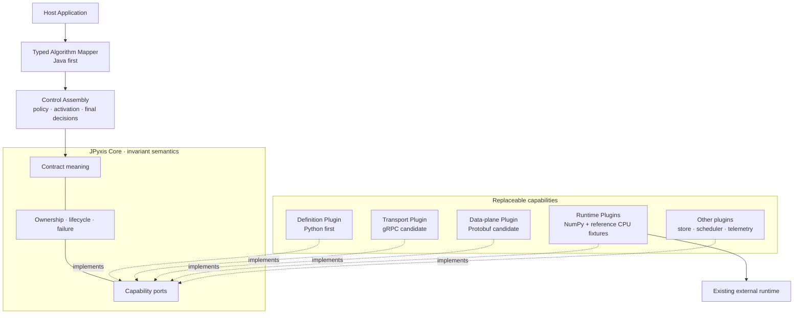
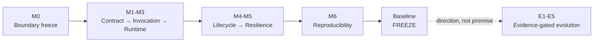
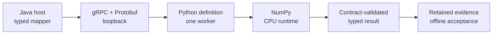

# JPyxis

> **Contract-Driven Heterogeneous Compute**
>
> Control governs. Definitions describe. Runtimes execute. Contracts bind.

JPyxis is a staged research framework for governing heterogeneous compute workloads through explicit, versioned contracts. Its first reference profile studies a Java control plane, a Python definition frontend, and an existing CPU runtime. Those languages and runtimes are reference adapters, not the identity of the architecture.

## Status

**`M0–M5 FROZEN · M6 REPRODUCIBILITY CANDIDATE`**

The repository now contains the bounded M1 contract model, independent Java and Python validators,
and a shared conformance corpus. It also contains one bounded M2 prototype: a typed Java mapper,
Java-owned invocation decision, loopback gRPC/Protobuf carrier, separate Python worker, NumPy affine
definition, retained evidence bundles, and offline verifier. M2 is a frozen single-slice prototype.
M3 is now a frozen bounded prototype that runs one runtime-neutral definition plan through NumPy and a
dependency-free Python reference runtime while retaining the same host contract and Control-owned
terminal decision. Its reviewed-head and merged-main evidence agree and remain independently
verifiable after both runtime processes exit. M4 is now a frozen bounded prototype that separates
immutable artifact facts, deployment state, active bindings, and invocation drain obligations in a
new module. Its reviewed-head and merged-main lifecycle evidence agree and remain independently
verifiable after the Java process exits.
M5 is now a frozen bounded prototype in a separate resilience module. It adds a
hash-chained durable journal, worker-instance supervision and epoch fencing, bounded retry decisions,
desired-intent recovery, and M4 reconciliation through public lifecycle actions. Its reviewed-head
and merged-main checks, downloaded evidence bundles, and offline verifier agree. M6 is now under
construction as an outer reproduction and evidence layer; it does not alter M1–M5 ownership or
implementation semantics. Until its fresh public run and independent evidence readback pass, M6 is
an unfrozen candidate rather than a project fact.

The M0 blueprint is frozen at `m0-blueprint-v1`; the bounded M1 contract layer is frozen at
`m1-contract-v1`; the bounded M2 invocation slice is frozen at `m2-invocation-v1`; and the first
bounded runtime-replacement boundary is frozen at `m3-runtime-v1`. The bounded lifecycle boundary is
frozen at `m4-lifecycle-v1`; the bounded resilience boundary is frozen at `m5-resilience-v1`. M1
validates only cross-binding contract identity, value validation, the selected compatibility subset,
and minimum evidence-envelope semantics in its recorded environments. It must
not be cited as proof of process invocation, performance, production readiness, distribution, GPU
support, runtime replaceability, or clean-machine reproducibility. The M3 freeze supports only
the bounded replacement claim recorded by its own gate; it cannot retroactively widen M1 or M2.

## Problem statement

Java-centric systems can already call Python, load portable models, or invoke external inference servers. The unresolved design question studied here is narrower:

> Can a host application retain authority over policy, lifecycle, version activation, failure interpretation, and business truth while definition frontends remain expressive and existing runtimes retain responsibility for execution?

JPyxis does not treat cross-language calling itself as novel. Its candidate contribution is a coherent contract and ownership model spanning:

- host-facing mapper ergonomics;
- scalar, record, and tensor meaning;
- immutable artifact identity and compatibility;
- deployment and invocation lifecycle;
- fault ownership and recovery evidence;
- replaceable definition, transport, and runtime adapters.

These are research hypotheses until experiments validate them.

## Architecture at a glance

JPyxis keeps invariant semantics at the centre and places replaceable mechanisms behind declared
capability ports. The diagram is a responsibility and dependency view, not an implemented component
inventory.



High cohesion is permitted inside a responsibility group. Between groups, only versioned contracts
and declared capabilities may cross the boundary. Runtime request flow never reverses compile-time
dependency or grants a plugin control-plane authority.

## First-stage proof boundary

Single-node execution is not a reduced substitute for the first stage. It is the declared proof boundary.

Within that boundary, M0-M6 must eventually provide real implementation, automated tests, fault injection, observable evidence, and clean-machine reproduction. Outside that boundary, this repository records only attachment points, entry conditions, and non-binding evolution directions.

The candidate reference environment is:

```text
RAM:      16 GB target, currently INFERRED rather than observed
CPU:      commodity x86-64
GPU:      not required
Topology: bounded single-node workers
Runtime:  CPU baseline
```

The `16 GB single-machine capable` claim becomes a project fact only after M6 records actual measurements.

## Architecture constitution

The M0 constitution is intentionally about invariants, not concrete API fields:

1. The contract is the only cross-boundary source of meaning.
2. The control plane owns decisions; a Java implementation is the first profile.
3. Definition frontends own declarative algorithm meaning; Python is the first profile.
4. Runtime adapters execute through existing runtimes; JPyxis does not rebuild kernels or tensor engines.
5. Events may cross a boundary; state ownership may not.
6. Every persisted fact has exactly one final authority.
7. Artifacts are immutable and content-addressed; activation is a separate control-plane fact.
8. Control and data planes remain separable.
9. Untyped escape hatches cannot silently replace contract semantics.
10. Future evolution must not charge complexity to the single-node baseline without evidence.
11. Core defines semantics; plugins provide capabilities.
12. Anything genuinely replaceable has no right to become a Core implementation dependency.

The normative M0 text is in [Architecture Constitution](docs/architecture/constitution.md).

## Roadmap semantics

`M` means a milestone that must be delivered and evidenced. `E` means an evolution direction that is not a delivery promise.



Each band closes its own responsibility boundary before the next band may depend on it. Later work
must not reach backwards through implementation shortcuts. See the normative
[Single-node Baseline](docs/roadmap/single-node-baseline.md) and the non-binding
[Evolution Map](docs/roadmap/evolution-map.md).

The named evolution directions remain `E1 High-performance Data Plane`, `E2 Accelerator Runtime`,
`E3 Distributed Control Plane`, `E4 Polyglot Definition Frontend`, and `E5 Runtime Ecosystem`.
They acquire milestone status only after their entry evidence is accepted.

## First reference vertical slice

M1 starts with one deliberately narrow path selected during M0. It proves contract meaning and
failure attribution before lifecycle, distributed control, accelerators, or production infrastructure
are allowed to widen the scope.



The reference workload is a deterministic, stateless batch affine transform with no external side
effects. Its acceptance and rejection boundaries are frozen in
[ADR-0004](docs/adr/0004-first-reference-vertical-slice.md). Passing it will prove only the bounded
slice—not performance, production readiness, GPU support, distribution, or an ecosystem.

Execution does not verify itself. [ADR-0005](docs/adr/0005-first-verifiable-end-to-end-closure.md)
separates invocation outcome, acceptance verdict, and project evidence state, and requires retained
evidence that can be checked after the Java and Python processes exit.

## M1 contract prototype

M1 chooses a canonical JPyxis semantic model rather than making the first Protobuf carrier the owner
of contract meaning. The bounded profile currently implements records, float32 and int32 scalars,
row-major tensors, fixed and symbolic dimensions, strict optionality, deterministic identity,
semantic value-set compatibility for the uncorrelated M1 subset, explicit rejection outside that
subset, and the minimum evidence-envelope separation required by ADR-0005.

```text
contract + identity lock + 38-case corpus
                    │
          ┌─────────┴─────────┐
          ↓                   ↓
 independent Java       independent Python
     binding                 binding
          └─────────┬─────────┘
                    ↓
       cross-binding report equality
```

Run the complete local M1 candidate gate from the repository root:

```text
node scripts/verify-repository.mjs
node scripts/verify-m1.mjs
```

The [M1 Contract Profile](docs/spec/m1-contract-profile.md) defines the bounded semantics,
[ADR-0006](docs/adr/0006-m1-canonical-contract-profile.md) records the representation decision, and
the [M1 Contract Review](docs/reviews/m1-contract-review.md) records the accepted evidence and what
remains unproven. M2 may now investigate the bounded invocation question without weakening M1.

## M2 invocation prototype

M2 implements only the first reference path fixed by ADR-0004. The Worker reports execution; the Java
Invocation Manager alone commits one terminal outcome; an external Acceptance Harness later reads the
retained bundle and emits a separate verdict. Neither gRPC status nor a Worker success label can
become invocation or project truth by itself.

Run the complete local candidate gate from the repository root:

```text
node scripts/verify-repository.mjs
node scripts/verify-m1.mjs
node scripts/verify-m2.mjs
```

`verify-m2.mjs` creates an isolated Python environment under the ignored `build/` directory, builds
the Java host, generates both carrier bindings from one Proto source, starts real Worker processes,
executes the success and failure matrix serially, stops both runtime processes, and runs the offline
verifier over retained bundles. The frozen matrix contains 18 executable cases, five
tamper cases, and one verifier-failure case.

The frozen prototype does not establish runtime replaceability, lifecycle, retry safety, recovery,
performance, production readiness, security isolation, accelerators, multi-host behavior,
clean-machine reproducibility, or business success. Those claims remain behind later named gates.

## M3 runtime abstraction prototype

M3 adds a product-neutral runtime capability requirement, pre-dispatch capability resolution, a
pinned runtime binding, a narrow Python Runtime Provider SPI, and two CPU fixtures. The M3 definition
plan describes the bounded affine operation without importing either runtime. NumPy arrays stay in
the NumPy provider; the reference provider uses only scalar Python and explicit float32 rounding.

The frozen gate executes both providers against the same host contract and definition,
compares exact float32 results with an independent oracle, verifies stable failure meaning, rejects
an incompatible capability before dispatch, rejects a changed binding before runtime start, and
rechecks retained evidence after the Java and Python processes exit. See
[ADR-0008](docs/adr/0008-m3-runtime-capability-resolution.md) and the
[M3 Runtime Abstraction Profile](docs/spec/m3-runtime-profile.md). The accepted public coordinates,
review corrections, and unproven claims are retained in the
[M3 Runtime Review](docs/reviews/m3-runtime-review.md).

Run the complete frozen regression chain from the repository root:

```text
node scripts/verify-repository.mjs
node scripts/verify-m1.mjs
node scripts/verify-m2.mjs
node scripts/verify-m3.mjs
```

This freeze does not prove an open plugin ecosystem, arbitrary third-party compatibility,
dynamic installation, general operation portability, lifecycle, performance, production readiness,
accelerators, distribution, or clean-machine reproducibility.

## M4 lifecycle prototype

M4 adds a separate Java lifecycle semantic module. `ArtifactRegistry` owns immutable bytes, digest,
and validation state. `DeploymentManager` alone decides load/warm/activate/drain/unload transitions
and the active binding for one slot. Runtime lifecycle capabilities report observations but cannot
write those facts.

The frozen gate exercises immutable identity conflict, failed warmup, activation preconditions,
atomic cutover, in-flight pinning, graceful drain, forced-termination requirements, and rollback to
a previously validated artifact. Slow capability calls execute outside the state lock, so warming a
candidate does not block admissions to the current active version. The complete regression chain is:

```text
node scripts/verify-repository.mjs
node scripts/verify-m1.mjs
node scripts/verify-m2.mjs
node scripts/verify-m3.mjs
node scripts/verify-m4.mjs
```

M4 does not move invocation terminal-state authority into lifecycle code. It records only which
deployment owes service to accepted work and whether a forced-termination decision is required. See
[ADR-0009](docs/adr/0009-m4-lifecycle-authority-and-cutover.md) and the
[M4 Lifecycle Profile](docs/spec/m4-lifecycle-profile.md). Exact public coordinates, review
corrections, and unproven claims are retained in the
[M4 Lifecycle Review](docs/reviews/m4-lifecycle-review.md).

## M5 resilience prototype

M5 keeps three new facts under separate owners: `WorkerSupervisor` owns worker instance state and
routing eligibility; `ResilientInvocationManager` owns logical invocation state, attempt lineage,
retry decisions, and the terminal outcome for the reference profile; `ControlIntentRegistry` owns
desired deployment intent. M4 continues to own immutable artifacts, actual deployment state, and
active bindings.

The frozen gate exercises two supervised worker processes, load/warmup/invocation/drain/unload
faults, explicit unknown outcomes, idempotency-gated retry, retry exhaustion, Control restart,
epoch fencing, M4 public-action reconciliation, telemetry failure, and late observations. Its
offline verifier also rejects truncated, reordered, corrupt, or incomplete retained evidence.

Run the complete frozen regression chain from the repository root:

```text
node scripts/verify-repository.mjs
node scripts/verify-m1.mjs
node scripts/verify-m2.mjs
node scripts/verify-m3.mjs
node scripts/verify-m4.mjs
node scripts/verify-m5.mjs
```

The freeze does not prove production durability, multi-host recovery,
distributed consensus, arbitrary side-effect safety, performance, clean-machine reproducibility,
resource isolation, accelerators, or production readiness. See
[ADR-0010](docs/adr/0010-m5-resilience-authority-and-recovery.md) and the
[M5 Resilience Profile](docs/spec/m5-resilience-profile.md). Exact public coordinates, review
corrections, and unproven claims are retained in the
[M5 Resilience Review](docs/reviews/m5-resilience-review.md).

## M6 reproducibility candidate

M6 composes the frozen gates into one ordered, retained journey: immutable source inspection,
isolated bootstrap, clean build, M1–M5 regression, real Java-to-Python invocation, lifecycle and
failure recovery, resource observation, rollback/final-state checks, runtime shutdown, and offline
evidence verification. It is deliberately an outer reference lab. Frozen semantic modules do not
import it, and an invocation success label cannot become the M6 acceptance verdict.

The local command is diagnostic and must remain `INCONCLUSIVE` because a prepared workstation is
not the authoritative clean environment:

```text
node scripts/verify-m6.mjs
```

The dedicated GitHub-hosted job starts from a fresh Ubuntu virtual machine, restores no dependency
cache, invokes the same script with `--public-clean`, and retains the complete bundle. Only that
coordinate may produce the public `PASS` candidate needed for review. The predeclared 16 GB
decision also requires an observed 14–18 GiB host, the full journey, a process-tree peak at or below
12 GiB, at least 2 GiB host memory remaining, no positive swap growth, and successful offline
predecessor verification.

See [ADR-0011](docs/adr/0011-m6-clean-reproduction-boundary.md) and the
[M6 Reproducibility Profile](docs/spec/m6-reproducibility-profile.md). No M6 freeze review, evidence
manifest, tag, or baseline-freeze claim exists yet.

## Documentation map

### Foundation

- [Conceptual Origin](docs/conceptual-origin.md)
- [Project Charter](docs/project-charter.md)
- [Long-horizon Vision](docs/vision.md)
- [Glossary](docs/glossary.md)
- [Evidence Policy](docs/evidence-policy.md)
- [Research Questions](docs/research/research-questions.md)

### Architecture

- [System Blueprint](docs/architecture/system-blueprint.md)
- [Architecture Constitution](docs/architecture/constitution.md)
- [Ownership and Truth Map](docs/architecture/ownership.md)
- [Dependency Rules](docs/architecture/dependency-rules.md)
- [State Machines](docs/architecture/state-machines.md)
- [Failure Model](docs/architecture/failure-model.md)
- [Contract Principles](docs/architecture/contract-principles.md)
- [M1 Contract Profile](docs/spec/m1-contract-profile.md)
- [M2 Invocation Profile](docs/spec/m2-invocation-profile.md)
- [M3 Runtime Abstraction Profile](docs/spec/m3-runtime-profile.md)
- [M4 Lifecycle Profile](docs/spec/m4-lifecycle-profile.md)
- [M5 Resilience Profile](docs/spec/m5-resilience-profile.md)
- [M6 Reproducibility Profile](docs/spec/m6-reproducibility-profile.md)

### Research and direction

- [Prior-art Matrix](docs/research/prior-art-matrix.md)
- [Primary References](docs/research/references.md)
- [Literature Review Protocol](docs/research/review-protocol.md)
- [Research Evidence Traceability](docs/research/evidence-traceability.md)
- [Single-node Baseline](docs/roadmap/single-node-baseline.md)
- [Evolution Map](docs/roadmap/evolution-map.md)

### Accepted M0 decisions

- [ADR-0001: Role-based control authority](docs/adr/0001-role-based-control-authority.md)
- [ADR-0002: Definition frontends declare but do not govern](docs/adr/0002-definition-without-governance.md)
- [ADR-0003: Reuse external runtimes](docs/adr/0003-reuse-external-runtimes.md)
- [ADR-0004: First reference vertical slice](docs/adr/0004-first-reference-vertical-slice.md)
- [ADR-0005: First verifiable end-to-end closure](docs/adr/0005-first-verifiable-end-to-end-closure.md)
- [ADR-0006: M1 canonical contract profile](docs/adr/0006-m1-canonical-contract-profile.md)
- [ADR-0007: M2 invocation authority and race rules](docs/adr/0007-m2-invocation-authority-and-races.md)
- [ADR-0008: M3 runtime capability resolution](docs/adr/0008-m3-runtime-capability-resolution.md)
- [ADR-0009: M4 lifecycle authority and cutover](docs/adr/0009-m4-lifecycle-authority-and-cutover.md)
- [ADR-0010: M5 resilience authority and recovery](docs/adr/0010-m5-resilience-authority-and-recovery.md)
- [ADR-0011: M6 clean reproduction boundary](docs/adr/0011-m6-clean-reproduction-boundary.md)

### Review records

- [M0 Architecture Review Gate](docs/reviews/m0-review-gate.md)
- [M0 Literature Closure](docs/reviews/m0-literature-closure.md)
- [M1 Contract Review](docs/reviews/m1-contract-review.md)
- [M2 Invocation Review](docs/reviews/m2-invocation-review.md)
- [M3 Runtime Review](docs/reviews/m3-runtime-review.md)
- [M4 Lifecycle Review](docs/reviews/m4-lifecycle-review.md)
- [M5 Resilience Review](docs/reviews/m5-resilience-review.md)

## Explicit non-goals for the single-node baseline

- building a deep-learning framework, tensor implementation, autograd system, compiler, BLAS library, CUDA kernel, or distributed communication stack;
- model training, multi-node scheduling, Kubernetes control, RDMA, NCCL, CUDA IPC, or model parallelism;
- arbitrary Python hot reload or direct access from definition code to production databases;
- per-operator RPC as the default execution model;
- claiming a universal algorithm schema before representative contracts are tested;
- presenting roadmap items as implemented capabilities.

## License

Apache License 2.0. See [LICENSE](LICENSE).
