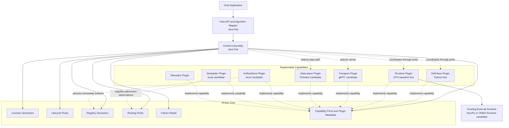

# System Blueprint

Status: `PROPOSED · M0`

This view separates invariant semantics from replaceable capability providers. It is a responsibility map, not an implemented component diagram.

## Logical structure



Arrows show logical use or reported capability. Compile-time dependency rules remain those in [Dependency Rules](dependency-rules.md): Core does not import concrete plugin packages.

## Core boundary

Core contains only semantics that must survive replacement:

```text
contract meaning
truth and state ownership
lifecycle invariants
routing eligibility
failure attribution
capability negotiation rules
```

Core may coordinate an `ArtifactStore`, but it does not contain a filesystem or remote-registry implementation. It may define routing eligibility, but it does not contain Kubernetes or local-process branches. It may require telemetry coordinates, but it does not depend on an exporter product.

## Capability boundary

A plugin provides a mechanism behind one or more declared capabilities:

| Capability family | First candidate | Possible later provider |
| --- | --- | --- |
| Definition | Python | Rust, Java, Lua, DSL |
| Runtime | minimal CPU runtime | ONNX Runtime, PyTorch, TensorRT |
| Transport | gRPC | another bounded transport |
| Data plane | Protobuf-carried small values | Arrow, shared memory, DLPack, CUDA IPC |
| Artifact storage | local filesystem or memory fixture | remote registry |
| Scheduling | local bounded worker selection | cluster scheduler |
| Telemetry | Micrometer or OpenTelemetry adapter | custom exporter |

Candidates are not selected implementations. The first M0 vertical-slice decision will deliberately choose the smallest set that proves the contract and ownership model.

## Control and data paths

The paths are distinct even if the first transport carries both small values and control messages.

```text
Control path
request identity → authorization context → contract/version binding
→ deployment eligibility → dispatch decision → lifecycle outcome

Data path
validated input value or typed handle → runtime
→ output value or typed handle → contract validation
```

The data path never decides authorization or activation. The control path does not become a permanent bulk-tensor carrier merely because the baseline uses one transport.

## Plugin rule

The phrase “everything is a plugin” means:

> Every replaceable capability is outside Core; every invariant semantic rule remains inside Core.

It does not mean every class requires an interface, every implementation is dynamically installed, or every future provider must be implemented now.

## Reference-profile constraint

The first reference profile may use Java, Python, gRPC, Protobuf, and one CPU runtime. Replacing a runtime or definition frontend must not require changes to the Host Application's business model or to Core state ownership. M3 is responsible for proving the first real replacement boundary.
